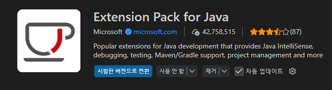

# java-springboot-2026

## 1일차

### 개발환경 설정

#### Java 설정

- 터미널/파워쉘에서 자바 설치여부 확인

```powershell
> java --version
openjdk 21.0.10 2026-01-20 LTS
OpenJDK Runtime Environment Temurin-21.0.10+7 (build 21.0.10+7-LTS)
OpenJDK 64-Bit Server VM Temurin-21.0.10+7 (build 21.0.10+7-LTS, mixed mode, sharing)
```

#### VS Code 설정
- 개발툴에 JDK 설정 다양
    - Eclipse, InteliJ, NetBeans, `Visual Studio Code` 중 선정

- VS Code 확장
    - Java 검색

    
    - 설치. Debugger 포함 6개 확장이 추가 설치됨

### Java 개발환경 확인

1. 명령 팔레트(ctrl + shift + P) 오픈

## 2일차
